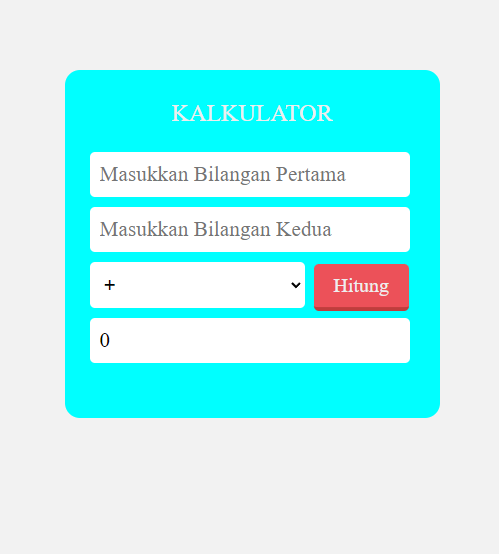

# Proyek Kalkulator

Proyek ini adalah aplikasi kalkulator sederhana yang dibuat menggunakan [PHP, HTML, CSS]. Aplikasi ini dirancang untuk melakukan operasi matematika dasar, termasuk penjumlahan, pengurangan, perkalian, dan pembagian.



## Fitur

- **Penjumlahan**: Tambahkan dua atau lebih angka.
- **Pengurangan**: Kurangi satu angka dari angka lainnya.
- **Perkalian**: Kalikan dua atau lebih angka.
- **Pembagian**: Bagi satu angka dengan angka lainnya.

## Teknologi yang Digunakan

- **Bahasa Pemrograman**: PHP
- **Frontend**: HTML, CSS


## Instalasi

1. **Clone Repository**
   ```bash
   git clone https://github.com/Sirpai05/kalkulator.git
